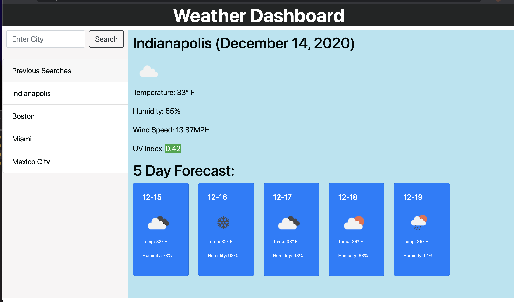

# Weather Dashboard

## Description
This site shows the current weather and 5 day forecast for the city that the caller enters.  Previous searches can be refreshed by clicking on the city name that populates in the column on the left.  When completely refreshing the page, the last previous search is populated.

[Deployed Site](https://sfunk11.github.io/weather-dashboard/)

## Steps to use

1.) Enter a city name into the search box and submit.
* The data for your selected city will be populated on the page, and the city name will be added to your "Previous Search" history.
2.) You can put in more cities, which will update the data and forecast each time, as well as add each city to your previous list.
 * If you click on one of the previously searched cities, the data for that city will populate as if you had just submitted it.
 3.) When you refresh the page, or close and reopen it,  the data for the last search will prepopulate the page when you load it.
 
 
